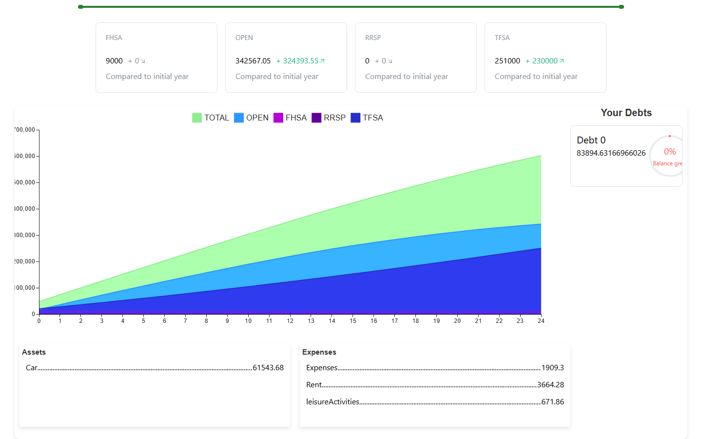
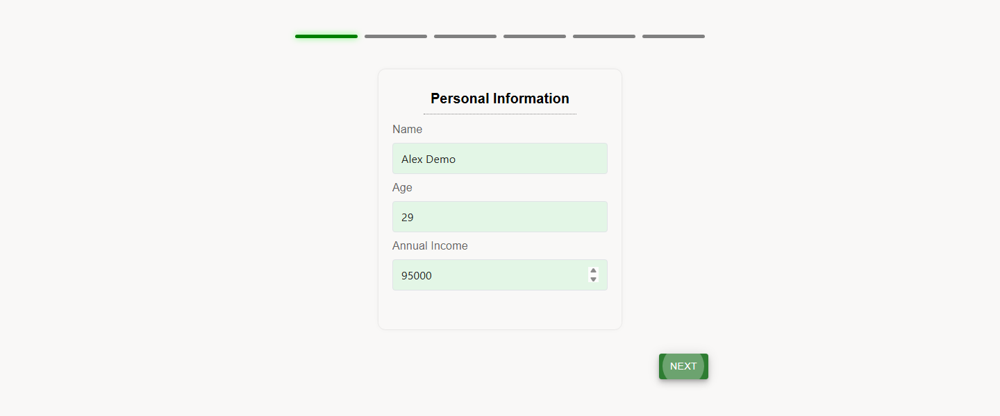
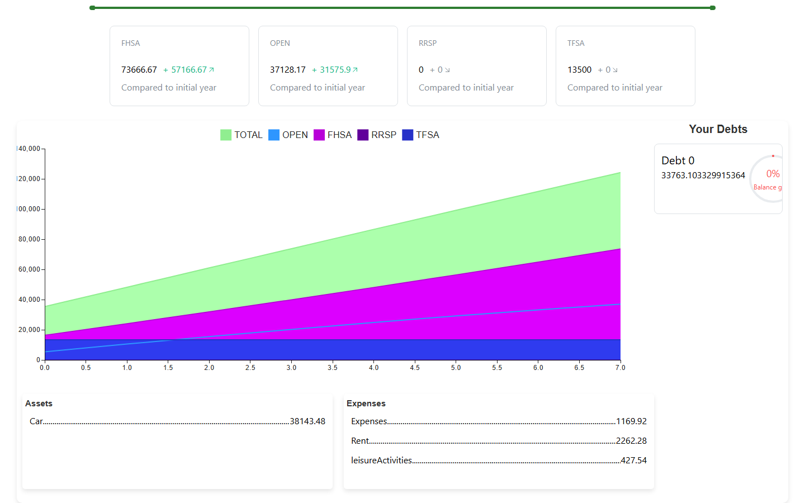

<div align="center">


# Net-Worth Projector

**A financial-education app built for SunLife's ConUHacks challenge: see your money's trajectory, with inflation doing its worst in the projection.**

[](https://devpost.com/software/raja-34wh87)
[](LICENSE)




</div>

---

Enter your income, assets, expenses, and goals, and watch your net worth curve unfold over decades — with inflation eroding it honestly instead of being politely ignored.

Most retirement calculators quote you a number in today's dollars and let you feel good about it. This one doesn't. Every year of the projection re-inflates your rent, your groceries, your leisure spending, and the house you're saving for, so the curve you see is the one you'd actually live through.

A Python backend computes post-tax income under Canadian account rules and allocates the leftover across account types; the React frontend renders the interactive trajectory. Dockerized, demoed, done in a weekend.

## What it does

1. You answer a short questionnaire — age, income, debts (with rates and terms), assets, monthly expenses, existing registered-account balances, and **one** financial goal.
2. The backend simulates year by year: taxes come off, expenses come off, debts get serviced and paid down, and whatever survives is allocated across FHSA / RRSP / TFSA / non-registered accounts according to your goal.
3. The frontend charts the result — a stacked area chart of every account plus a running total, with a range slider to scrub across the projection window.



The four goals change both the allocation strategy and the length of the projection:

| Goal | Code | Strategy | Horizon |
|---|---|---|---|
| Buy a house | `H` | Fill FHSA first, then RRSP, then remaining FHSA room | Runs until savings cover a 20% down payment on the inflation-adjusted house price, or 25 years, whichever comes first |
| Retirement | `R` | Maximize RRSP (deducted pre-tax), overflow into TFSA and non-registered | 25 years |
| Long-term investing | `I` | Fill TFSA to the annual limit, overflow into non-registered | 25 years |
| Pay down debt | `PD` | All surplus to debt, highest interest rate first | Runs until every non-mortgage debt is cleared, or 25 years, whichever comes first |

Both open-ended goals stop at 25 years whether or not they got where they were going. A `PD` run on negative cashflow ends with the debt still outstanding, and an `H` run whose house price outruns the savings ends short of the down payment — in each case the projection is complete and simply shows the goal unmet.

The horizon is visible in the chart itself. The same inputs under the house goal stop after a handful of years, as soon as savings overtake the 20% down payment on a house price that has been inflating the whole time:



## The projection model

The engine is a single module — [`backend/blueprints/backend.py`](backend/blueprints/backend.py) — exposed as `POST /backend/createStory`. It is a deterministic year-loop with stochastic rate draws. Here's what each stage actually does.

### 1. Post-tax income — `compute_taxes(income)`

Full marginal bracket math for **2023 Canadian federal + Quebec provincial** rates (ConUHacks is in Montreal, so Quebec is the province modelled):

- **Federal:** 15% → 20.5% → 26% → 29% → 33%, at $53,359 / $106,717 / $165,430 / $235,675
- **Quebec:** 14% → 19% → 24% → 25.75%, at $49,275 / $98,540 / $119,910

Tax is applied bracket by bracket, not as a flat effective rate. On $100,000 gross this returns **$65,825**, a ~34% effective rate — which is about right for Quebec.

### 2. RRSP room — `rrsp(last_rrsp, pre_tax_income, max_rrsp)`

Contribution room is 18% of earned income capped at the annual dollar limit (seeded at $32,490). The cap grows each simulated year by a random $612–$812, approximating how CRA indexes the limit. In the retirement (`R`) path the RRSP contribution is subtracted from income **before** `compute_taxes` runs, so the pre-tax deduction is modelled properly rather than bolted on afterwards.

### 3. Expenses and debt service

- `calculate_invest_funds_with_debts(...)` subtracts annualized rent, leisure, and general expenses from after-tax income.
- `calculate_monthly_payment(principal, rate, years)` is the standard amortization formula, used to service mortgages every year of their term.
- `calculate_invest_funds(...)` runs the **debt avalanche**: `maxRate()` picks the highest-interest non-mortgage debt, surplus is thrown at it, and the loop repeats until the money runs out. Debts left unpaid accrue at their own interest rate. There's a deliberate heuristic here — debts under **6%** are *not* prioritized, on the reasoning that expected market returns beat paying them down early.

### 4. Allocation across account types — `contribution_calculation(...)`

A waterfall that fills tax-advantaged room in the order that suits the goal, then spills over:

- **`H`** → FHSA $8,000 → RRSP `min(18% of income, $32,490)` → remaining FHSA room → non-registered
- **`I`** / **`R`** → TFSA (limit grows as `7500 + year * 500/3`, modelling indexation) → non-registered
- **`PD`** → everything to non-registered, since surplus is going to debt

Each year's closing balances become the next year's opening balances, so the accounts compound.

### 5. Inflation — `inflation(amount)`, `inflated_expenses()`, `inflated_assets()`

This is the part the app is built around. Every year, **every** cost and asset is re-drawn against inflation sampled uniformly from **1.89%–3.89%** (centred on ~2.89%):

- `inflated_expenses()` re-inflates rent, leisure, and general expenses
- `inflated_assets()` re-inflates every declared asset
- the target house price is re-inflated each year in the `H` path, so the down-payment goalpost moves while you save for it
- `income_increase()` raises income by a random **1.09%–2.69%** — deliberately *below* the inflation band's midpoint, so real wages drift down over the projection unless you're contributing

Over a 25-year run, $1,500/month rent compounds to roughly **$3,000/month**. That erosion is the whole point of the app.

### Known limitations

This was built in a weekend and the modelling has rough edges worth naming:

- Rates are sampled randomly per year rather than seeded, so **two identical requests return different curves**.
- Investment growth is applied through the contribution waterfall rather than an explicit rate-of-return per account.
- The `R` path can drive the TFSA balance negative when the RRSP pre-tax deduction leaves too little cash to cover expenses — the leftover is written to the account without a floor at zero.
- Outside the `PD` goal the allocator only attacks debts above 6% interest, so a cheaper loan is never paid down at all — it just compounds for the whole projection. That is why the screenshots above show a car loan whose balance grows rather than shrinks.
- Tax brackets are hardcoded to 2023 and Quebec only.
- The `financial_computation()`, `expenses()`, and `long_term_investement()` functions in the same module are unfinished scratch from the hackathon and are not called by the endpoint.

## Architecture

```
┌─────────────────────────────┐         ┌──────────────────────────────┐
│  frontend/  React 18 + TS   │         │  backend/   Flask (Python)   │
│                             │         │                              │
│  Home.tsx                   │  POST   │  app.py                      │
│   questionnaire, builds     │ ──────► │   /backend  → blueprints/    │
│   the request payload       │  JSON   │               backend.py     │
│                             │         │   /api      → blueprints/    │
│  StoryLine.tsx              │ ◄────── │               template.py    │
│   MUI x-charts LineChart,   │  years[]│                              │
│   range slider, stat cards  │         │  tax → expenses → debt →     │
│                             │         │  allocate → inflate, ×N yrs  │
│  MUI + Mantine + framer     │         │                              │
└─────────────────────────────┘         └──────────────┬───────────────┘
                                                       │
                                              ┌────────▼────────┐
                                              │  MongoDB        │
                                              │  (docker-compose│
                                              │   service)      │
                                              └─────────────────┘
```

**The projection itself is stateless.** `POST /backend/createStory` takes the full profile in the request body and returns the complete `years[]` array in the response — nothing is persisted to compute a projection. MongoDB is wired up via `docker-compose.yml` and backs a generic CRUD blueprint (`blueprints/template.py`, mounted at `/api`) that was scaffolded during the hackathon but is **not** used by the projection flow.

| Path | What lives there |
|---|---|
| `backend/blueprints/backend.py` | The tax, debt, allocation, and inflation engine |
| `backend/blueprints/template.py` | Generic Mongo CRUD scaffold, mounted at `/api` |
| `backend/app.py` | Flask app, CORS, blueprint registration |
| `backend/docker-compose.yml` | Flask + MongoDB services |
| `frontend/src/pages/Home.tsx` | Multi-step questionnaire, builds and posts the payload |
| `frontend/src/pages/StoryLine.tsx` | Chart, range slider, per-account stat cards |
| `frontend/src/components/` | Question-page components for debts and assets |

## Quickstart

Requires Docker and Node 16+.

### 1. Backend (Docker)

```bash
cd backend
docker compose up --build
```

Flask comes up on `http://localhost:5000` with MongoDB alongside it. Check it:

```bash
curl http://localhost:5000/api/
# Flask App is running
```

And exercise the engine directly:

```bash
curl -X POST http://localhost:5000/backend/createStory \
  -H "Content-Type: application/json" \
  -d '{
    "name": "Sam", "age": 30, "annualIncome": 100000,
    "financialGoal": "I", "houseValue": 0,
    "debts": [{"id": 1, "type": "student", "interestRate": "0.05", "amount": "20000", "years": "10"}],
    "assets": [{"name": "car", "value": 15000}],
    "expenses": {"Rent": 1500, "leisureActivities": 300, "Expenses": 800},
    "investments": {"FHSA": 0, "TFSA": 0, "RRSP": 0, "OPEN": 0}
  }'
```

You'll get back the input echoed with a `years` array — 25 entries for goal `I`, each carrying that year's `investments`, `debts`, `assets`, `expenses`, and `income`.

<details>
<summary>Running the backend without Docker</summary>

```bash
cd backend
python -m venv venv && source venv/bin/activate   # Windows: venv\Scripts\activate
pip install -r requirements.txt
python app.py
```

The projection endpoint needs no database. The `/api` CRUD routes expect Mongo at the host `mongo` (see `mongo_utils/getDatabase.py`) and will fail without it.

</details>

### 2. Frontend

```bash
cd frontend
npm install
npm start
```

Opens on `http://localhost:3000` and posts to `http://localhost:5000/backend/createStory`, which is hardcoded in `Home.tsx`.

## Built at ConUHacks 2024

Built in a weekend at **ConUHacks IX** (Concordia University, January 2024) for the **SunLife challenge** on financial education.

- [@Arty2001](https://github.com/Arty2001)
- Rehean Thillai — [@reheant](https://github.com/reheant)
- Abilash Sasitharan — [@Abilash10](https://github.com/Abilash10)
- [@KingoftheCourt](https://github.com/KingoftheCourt)
- Joerex Thambaiah — backend engine work, per the commit history

**Devpost:** https://devpost.com/software/raja-34wh87

## License

[MIT](LICENSE)
